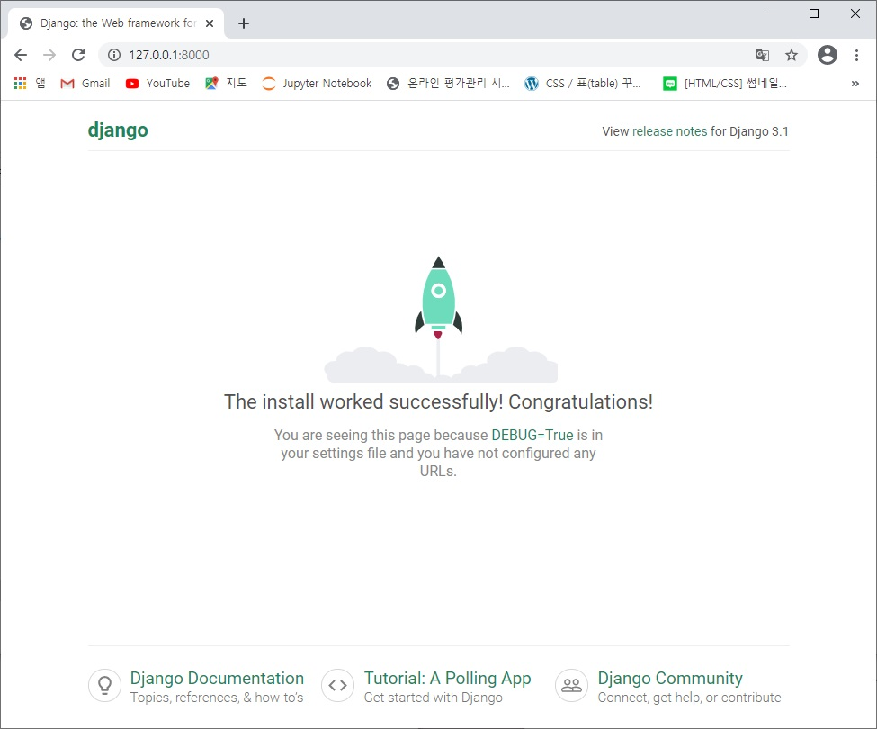

## 프로젝트 뼈대 만들기


### 1. 프로젝트 생성

```cmd
django-admin startproject mysite
```


### 2. 애플리케이션 생성

```cmd
python manage.py startapp polls
```


### 3. 프로젝트 설정 파일 변경

> Settings.py 편집

```python
ALLOWED_HOSTS = ['192.168.123.104', 'localhost', '127.0.0.1']		# 변경

...

INSTALLED_APPS = [
    'django.contrib.admin',
    'django.contrib.auth',
    'django.contrib.contenttypes',
    'django.contrib.sessions',
    'django.contrib.messages',
    'django.contrib.staticfiles',
    'polls.apps.PollsConfig',										# 추가
]

...

TIME_ZONE = 'Asia/Seoul' 											# 변경
```


### 4. 기본테이블 생성

```cmd
python manage.py migrate
```


### 5. 작업 확인

* Web server 실행

  ```
  python manage.py runserver 0.0.0.0:8000
  ```

* Web server 접속 (http://127.0.0.1:8000)

  

* super 유저 생성

  ```
  python manage.py createsuperuser
  ```

* Web server admin 접속 (http://127.0.0.1:8000/admin)

  
  
  
  

