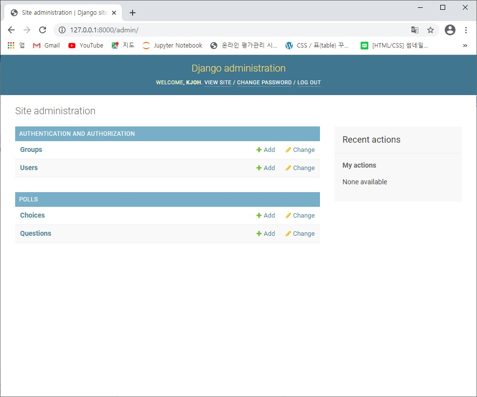

## Model 코딩


### 1. 테이블 정의

> models.py 편집

```python
from django.db import models


class Question(models.Model):
    question_text = models.CharField(max_length=200)
    pub_date = models.DateTimeField('date published')

    def __str__(self):
        return self.question_text


class Choice(models.Model):
    question = models.ForeignKey(Question, on_delete=models.CASCADE)
    choice_text = models.CharField(max_length=200)
    votes = models.IntegerField(default=0)

    def __str__(self):
        return self.choice_text

```


### 2. Admin 사이트에 테이블 반영

> admin.py 변경

```python
from django.contrib import admin
from polls.models import Question, Choice


admin.site.register(Question)
admin.site.register(Choice)
```


### 3. 데이터베이스 변경사항 반영

* 마이그레이션 파일 생성

  ```
  python manage.py makemigrations
  ```

* 데이터베이스에 테이블 생성

  ```
  python manage.py migrate
  ```


### 4. 작업 확인

* http://127.0.0.1:8000/admin/

* Question, Choice 테이블 생성 확인

  

